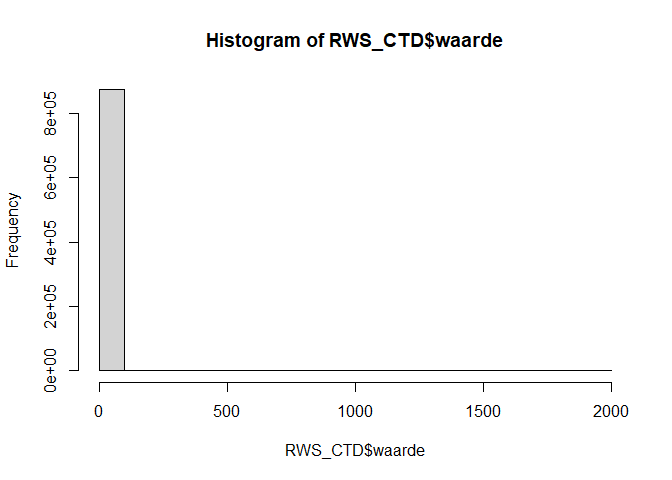
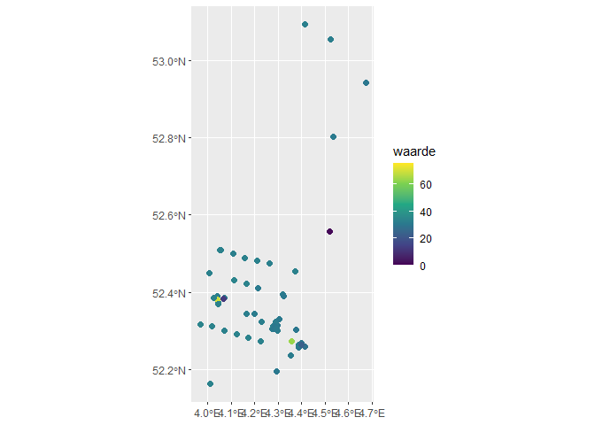

beacon test
================
Willem Stolte
2024-11-20

First, we’ll have a look at the RWS-CTD dataset. The body definition as
json is copied from the example on
<https://github.com/maris-development/beacon-poc-rws>.

``` r
RWS_CTD_body = '{
  "query_parameters": [
    {
      "column_name": "numeriekewaarde",
      "alias": "waarde"
    },
    {
      "column_name": "begindatum",
      "alias": "TIME"
    },
    {
      "column_name": "diepte",
      "alias": "DEPTH"
    },
    {
      "column_name": "diepte_eenheid",
      "alias": "DEPTH unit"
    },
    {
      "column_name": "longitude",
      "alias": "LONGITUDE"
    },
    {
      "column_name": "latitude",
      "alias": "LATITUDE"
    },
    {
      "column_name": "parameteromschrijving",
      "alias": "parameteromschrijving"
    },
    {
      "column_name": "parametercode",
      "alias": "parametercode"
    },
    {
      "column_name": "eenheidcode",
      "alias": "eenheidcode"
    },
    {
      "column_name": "grootheidcode",
      "alias": "grootheidcode"
    },
    {
      "column_name": "typeringcode",
      "alias": "typeringcode"
    },
    {
      "column_name": "FID",
      "alias": "FID"
    },
    {
      "column_name": "diepte_grootheid",
      "alias": "diepte_grootheid"
    },
    {
      "column_name": "druk",
      "alias": "druk"
    },
    {
      "column_name": "druk_eenheid",
      "alias": "druk_eenheid"
    },
    {
      "column_name": "druk_grootheid",
      "alias": "druk_grootheid"
    },
    {
      "column_name": "geom",
      "alias": "geom"
    },
    {
      "column_name": "hoedanigheidcode",
      "alias": "hoedanigheidcode"
    },
    {
      "column_name": "index",
      "alias": "index"
    },
    {
      "column_name": "metadata_index",
      "alias": "metadata_index"
    },
    {
      "column_name": "waardebepalingsmethodecode",
      "alias": "waardebepalingsmethodecode"
    },
    {
      "column_name": "waardebewerkingsmethodecode",
      "alias": "waardebewerkingsmethodecode"
    }],
  "filters": [
    {
      "for_query_parameter": "LONGITUDE",
      "min": 3.946140,
      "max": 5.164450
    },
    {
      "for_query_parameter": "LATITUDE",
      "min": 52.128319,
      "max": 53.239434
    },
    {
      "for_query_parameter": "grootheidcode",
      "eq": "SALNTT"
    }],
  "output": {
    "format": "csv"
  }}'
```

``` r
RWS_CTD_body_list <-  jsonlite::fromJSON(RWS_CTD_body)

RWS_CTD_body_list$query_parameters %>%
  knitr::kable(caption = "paramter names and their aliases used for RWS_CTD request")
```

| column_name                 | alias                       |
|:----------------------------|:----------------------------|
| numeriekewaarde             | waarde                      |
| begindatum                  | TIME                        |
| diepte                      | DEPTH                       |
| diepte_eenheid              | DEPTH unit                  |
| longitude                   | LONGITUDE                   |
| latitude                    | LATITUDE                    |
| parameteromschrijving       | parameteromschrijving       |
| parametercode               | parametercode               |
| eenheidcode                 | eenheidcode                 |
| grootheidcode               | grootheidcode               |
| typeringcode                | typeringcode                |
| FID                         | FID                         |
| diepte_grootheid            | diepte_grootheid            |
| druk                        | druk                        |
| druk_eenheid                | druk_eenheid                |
| druk_grootheid              | druk_grootheid              |
| geom                        | geom                        |
| hoedanigheidcode            | hoedanigheidcode            |
| index                       | index                       |
| metadata_index              | metadata_index              |
| waardebepalingsmethodecode  | waardebepalingsmethodecode  |
| waardebewerkingsmethodecode | waardebewerkingsmethodecode |

paramter names and their aliases used for RWS_CTD request

``` r
RWS_CTD_body_list$filters %>%
  knitr::kable(caption = "filter used for RWS_CTD request")
```

| for_query_parameter |      min |      max | eq     |
|:--------------------|---------:|---------:|:-------|
| LONGITUDE           |  3.94614 |  5.16445 | NA     |
| LATITUDE            | 52.12832 | 53.23943 | NA     |
| grootheidcode       |       NA |       NA | SALNTT |

filter used for RWS_CTD request

``` r
RWS_CTD_body_list$output
```

    ## $format
    ## [1] "csv"

If you want to change the body list and make it json again for use in
the query, a new body can be produced by:

``` r
new_RWS_CTD_body <- jsonlite::toJSON(RWS_CTD_body_list, auto_unbox = T)
```

The request with the original body is sent to beacon.

``` r
headers = c('Content-type' = 'application/json')

RWS_CTD_response <- VERB(
  "POST", 
  url = "https://beacon-poc-rws-ctd.maris.nl/api/query", 
  body = RWS_CTD_body,
  add_headers(headers)
)
```

``` r
RWS_CTD <- read_csv(
  content(RWS_CTD_response, as = 'text'), 
  show_col_types = FALSE
)
```

    ## No encoding supplied: defaulting to UTF-8.

``` r
# check values
hist(RWS_CTD$waarde)
```

<!-- -->
Apparently, 1999 is used as NA value. This value is set to NA.

``` r
RWS_CTD <- RWS_CTD %>%
  mutate(waarde = na_if(waarde, 1999))
```

Plot coordinates and values a random sample of 10000.

``` r
require(sf)
```

    ## Loading required package: sf

    ## Linking to GEOS 3.12.1, GDAL 3.8.4, PROJ 9.3.1; sf_use_s2() is TRUE

``` r
RWS_CTD %>%
  st_as_sf(coords = c("LONGITUDE", "LATITUDE"), crs = 4236) %>%
  sample_n(1000) %>%
  ggplot() +
  geom_sf(aes(color = waarde), size = 2) +
  scale_color_viridis_c()
```

<!-- -->
